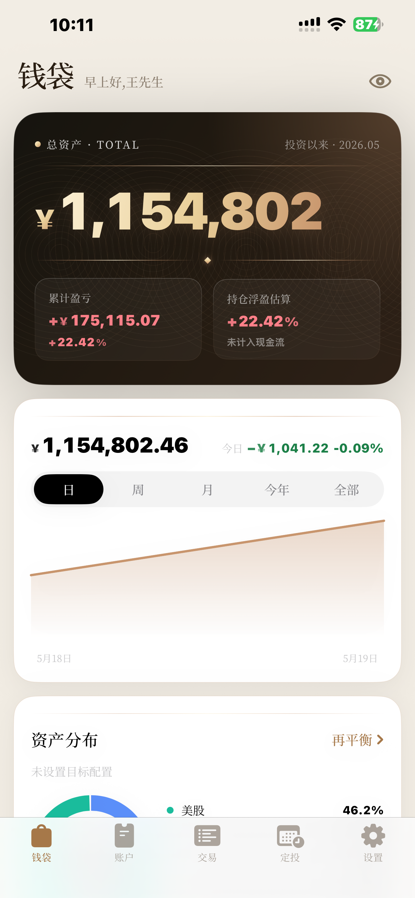
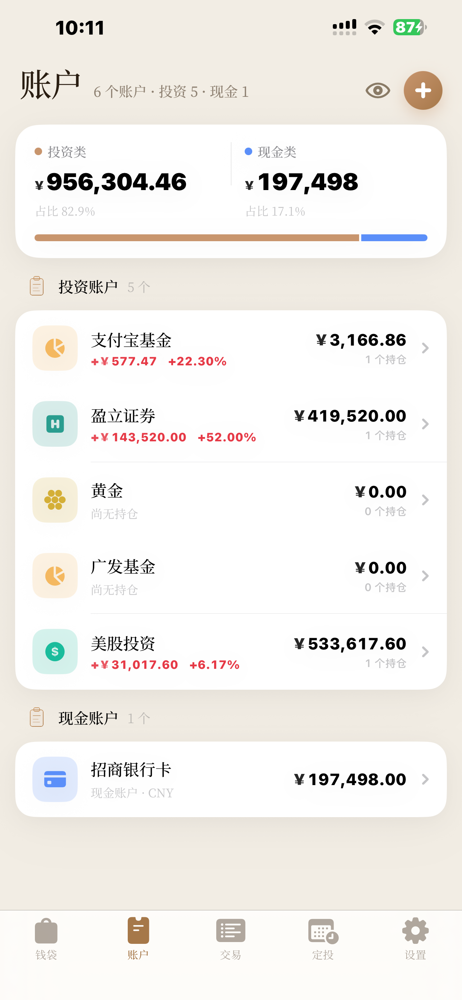
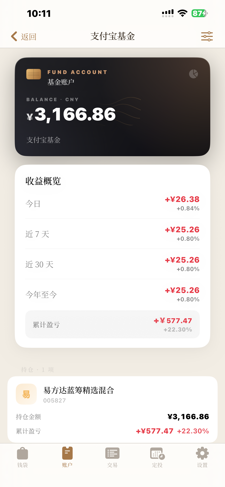
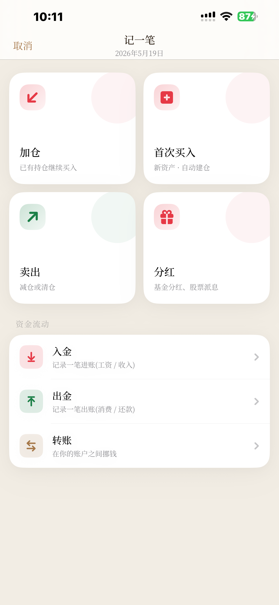
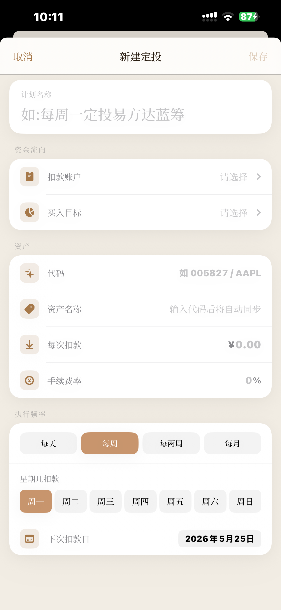
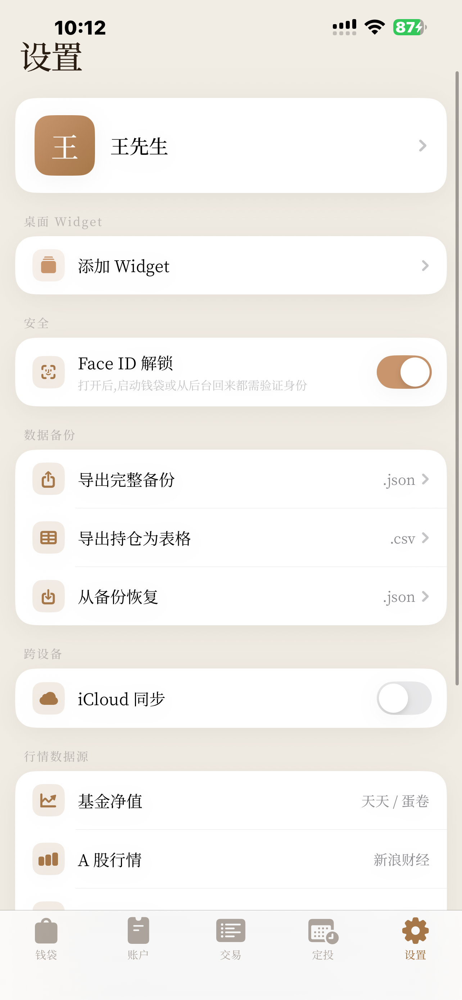

# 钱袋 · MoneyMap

> 把你的钱装一起 — 个人资产记账,本地优先

钱袋是一款 iOS 上的个人资产口袋。把现金、基金、A 股、港股、美股、黄金、定投装进同一个口袋,一眼看到全部资产和今日盈亏 — 不再打开五六个 App 才能凑出"我现在有多少钱"。

数据全部存在你自己的设备上,可选 iCloud 同步(端到端加密)。没有后端、没有账号、没有埋点。

- 落地页:<https://sakurallxa.github.io/moneymap-site/>
- 隐私政策:<https://sakurallxa.github.io/moneymap-site/privacy.html>

---

## 功能

| 模块 | 说明 |
| --- | --- |
| 资产汇总 | 现金 / 基金 App / 券商(A 股 · 港股 · 美股)/ 黄金存折与实物 · 多账户多币种,自动按汇率折人民币 |
| 行情同步 | 基金净值、A 股、港美股、上海黄金现货、人民币汇率 — 下拉刷新即更新 |
| 定投计划 | 每日 / 每周 / 双周 / 每月扣款,含手续费率,T+1 自动确认份额并加权重算 avgCost |
| 再平衡建议 | 设目标比例 → 算偏离度 → 一键预填"该买多少 / 该卖多少" |
| 主屏 Widget | 小 / 中尺寸,总资产 + 今日盈亏一眼可见 |
| Face ID 锁 | 入口生物识别锁,系统弹窗 / 密码 fallback 自动接管 |
| 数据可携 | 一键导出 `.json` 完整备份 + `.csv` 持仓表格 |

## 截图

<p>
  
  
  
</p>
<p>
  
  
  
</p>

## 技术栈

- SwiftUI + SwiftData(iOS 17+)
- WidgetKit(主屏小部件)
- LocalAuthentication(Face ID / 密码 fallback)
- CloudKit(可选 iCloud 同步,端到端加密)
- 中文衬线主字 — 思源宋体 / 宋体 SC fallback,见 [`docs/TYPOGRAPHY.md`](docs/TYPOGRAPHY.md)

行情数据通过 `QuoteResolver` 按账户类型与代码后缀分发到对应 `PriceService`,失败时回落至最近一次缓存价。

## 数据与隐私

- 所有持仓、交易、定投配置、价格缓存写入本地 SwiftData 容器
- iCloud 同步默认 **关闭**;开启后通过用户自己的 iCloud Drive 加密同步,Apple 也读不到明文
- 行情接口仅出站 GET 公开行情,不上送任何持仓 / 身份信息
- 没有第三方 SDK、没有埋点、没有用户画像

完整声明见 [隐私政策](https://sakurallxa.github.io/moneymap-site/privacy.html)。

## 构建

```sh
open MoneyMap.xcodeproj
```

- 最低部署:iOS 17.0
- 简体中文 locale 优化(`Locale(identifier: "zh_CN")`)
- 字体:仓内不带 OTF(共 ~88 MB),先按 [`MoneyMap/Fonts/README.md`](MoneyMap/Fonts/README.md) 下载 Source Han Serif SC 4 个字重并加进 target 的 Copy Bundle Resources;运行时通过 `CTFontManagerRegisterFontsForURL` 动态注册,无需改 `Info.plist`

## 测试

```sh
xcodebuild test \
  -project MoneyMap.xcodeproj \
  -scheme MoneyMap \
  -destination 'platform=iOS Simulator,name=iPhone 16,OS=18.6'
```

当前覆盖:

- `TransactionReversalServiceTests` — 删除交易的反向应用(买 / 卖 / 分红 / DCA 在途 / DCA 已确认 / 转账 / 入金,共 14 例)
- `DCAServiceTests` — `triggerDuePlans` 三态、`confirmRipePending` 同轮去重、`manuallyConfirm`(6 例)

测试用 in-memory SwiftData 容器,helper 强引用 container 避免 ARC 释放后 `context.insert` 静默崩溃(`MoneyMapTests/SwiftDataTestHelper.swift`)。

## 致谢

设计语言:铜 + 米 + 黑金 hero · 中文衬线大标题 · 灯笼 / 鸿运红描金等节庆背板。

行情来源:天天基金、蛋卷基金、新浪财经、雅虎财经、上海黄金交易所,所有数据用于估值,不构成投资建议。

## 联系

- 邮箱:myrt.chaos@gmail.com
- 站点:<https://sakurallxa.github.io/moneymap-site/>

---

© 2026 钱袋 · MoneyMap
